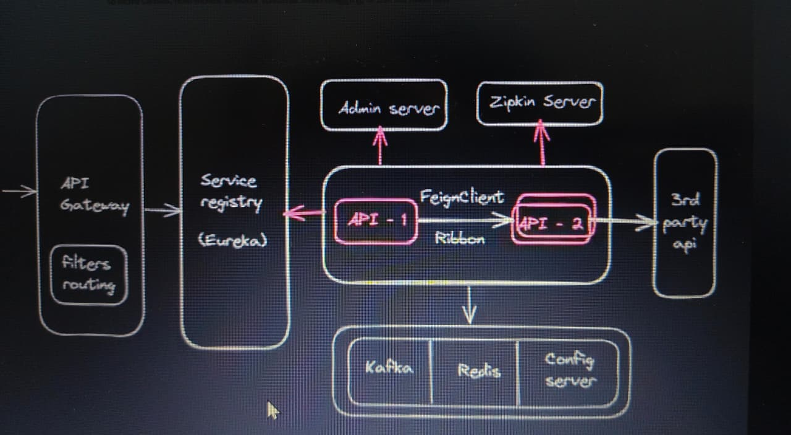

# Microservices 

## What is monolithic application ?
``` text
🔹 What is a Monolithic Application?
A Monolithic Application is a software architecture where the entire application is built as a single unit.Single large codebase ,single Database
, everything tightly coupled.


🔹 Simple Idea
One big application → one codebase → one deployment

🔹 Example (Real-world analogy )
Think of a restaurant where one person does everything:

Takes orders
Cooks food
Serves customers


# Drwabacks of Monolithic architecture


1) Single Point of failure :: 
  
    In a monolithic application, all modules (User, Product, Order, Payment, etc.) run inside one application.Now imagine the Payment Module has a 
	bug and causes the application to crash.If the application crashes, every feature becomes unavailable.

2) Re-Deploy entire app ::

   Even if you change only one small feature, you must rebuild and deploy the entire application.
   
3) Maintenence of the app ::
     As the application grows, it becomes difficult to understand, update, and fix.
	 
4) Burden on server :: 
    
	In a monolithic application, all modules run on the same server.
    If one module receives heavy traffic, you must scale the entire application, even though the other modules are not busy.


```
---


## What are microservices ?
```text 
It is an architectural desing pattern.Microservices is a way of building an application by dividing it into small, independent parts (services), 
where each part does one specific job and works on its own.

 In very easy words:
Instead of making one big application, you make many small applications that work together.

 Example:
Think of a shopping app:


Login → one service
Payment → another service
Orders → another service


Each service works independently but connects with others.


# Advantages  :: 

1) Loosely Coupled :

   In a microservices architecture, each service is independent of the others.
   A change in one service usually does not affect the others.
   
2) Easy Maintenence :

   Each microservice is small and focuses on one specific business function.
   This makes the code easier to understand, debug, and maintain.
   
3) Load will be distributed :
  
    Each service can be scaled independently based on its traffic.
	
4) Technology Independency :

     Each microservice can be developed using the technology that best fits its requirements.
     One service is not forced to use the same programming language or database as the others.
	 
5) High Availability :
      
	If one microservice fails, the other services can continue working.
	The failure is isolated to that service.


# Disadvantage :: 


1) Bounded Context (deciding no.of rest apis to develop)
2) Duplicate Configuration
3) Visibility


```
---

## Microservices Architecture




```text

  
-> There is no standard architecture for Microservices development

-> People are customizing microservices project architecture according to their requirement.


1) Service Registry
2) Admin Server
3) Zipkin Server
4) Backend Services (REST APIs)
5) API Gateway
6) Feign Client
7) Config Server
8) Apache Kafka
9) Redis Cache
10) Docker

```
---


##  Service Registry 

``` text

A Service Registry is a central directory where all the microservices register themselves so that other services can find and communicate with them.


-> Service Registry is used to maintain list of services available in the project.

-> It provides information about registered services like

		Name of service, url of service, status of service

-> It provides no.of instances available for each service.

-> If a service crashes, it is removed from the registry.

-> We can use Eureka Server as a service registry

-> Eureka server provided by Spring Cloud Netflix library

```
---

## Admin Server 

```text 

-> Actuators  are used to monitor and manage our applications

-> Monitoring and managing all the apis seperatley is a challenging task

-> Admin Server Provides an user interface to monitor and manage all the apis at one place using actuator endpoints.


How it works ::

Step 1: Admin Server starts

Spring Boot Admin Server

↓
Waits for applications to register.

Step 2: Microservices register

User Service  ------------\
Order Service  ------------> Admin Server
Payment Service ----------/

The Admin Server now knows about all running services.

Step 3: Dashboard

-----------------------------------
Spring Boot Admin Dashboard
-----------------------------------
User Service        UP
Order Service       UP
Payment Service     DOWN
Inventory Service   UP
-----------------------------------

You can click a service to see more details such as:

Health
Metrics
Beans
Environment
Configuration
Loggers
Mappings

```
---

## Zipkin Server

```text

 A Zipkin Server is used for distributed tracing in a microservices architecture.

When a single user request passes through multiple microservices, Zipkin helps you trace the complete journey of that request and identify where 
time is being spent or where failures occur.

-> It is Used for Distributed tracing

-> Using zipkin server, we can monitor which api is taking more time to process request.

-> Using Zipkin we can understand how many apis involved in request processing.

```
---

## Backend apis
``` text

-> Backend apis contains business logic

-> Backend apis are also called as REST APIs / services / microservices

	Ex: payment-api, cart-api, flights-api, hotels-api

Note: Backend api can register as client for Service Registry, Admin server & Zipkin server (It is optional)

```
---


## FeignClient

``` text

-> It is provided by spring cloud libraries

-> It is used for Inter Service Communication

-> Inter service communication means one api is accessing another api using Service Registry. 

Note: External communication means accessing third party apis.

-> When we are using FeignClient we no need mention URL of the api to access. Using service name feign client will get service URL from s
service registry.

-> Feign Client uses Ribbon to perform Client side load balancing.

 Note: Ribbon is deprecated. It has been replaced by Spring Cloud LoadBalancer.


```
---


## Load Balancing 

```text 

Load Balancing is the process of distributing incoming requests across multiple instances of the same service so that no single instance 
becomes overloaded.

```
---


